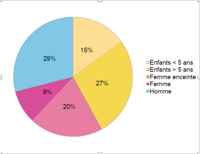
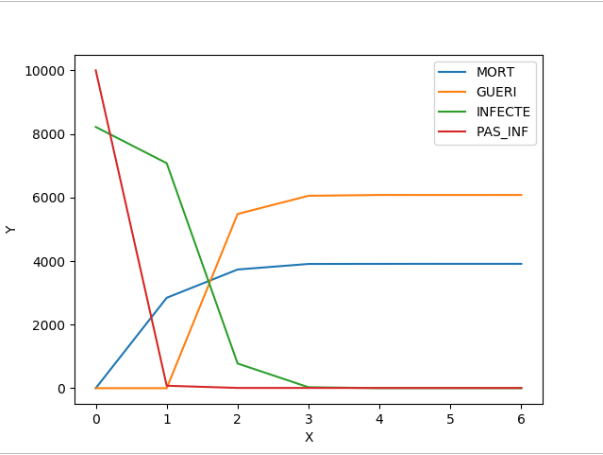
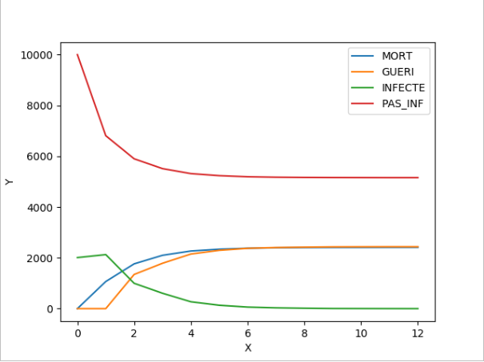
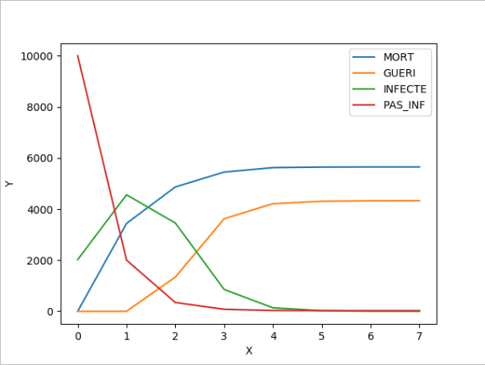
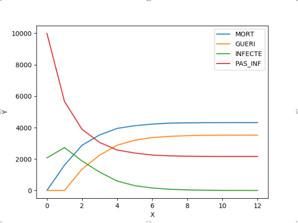
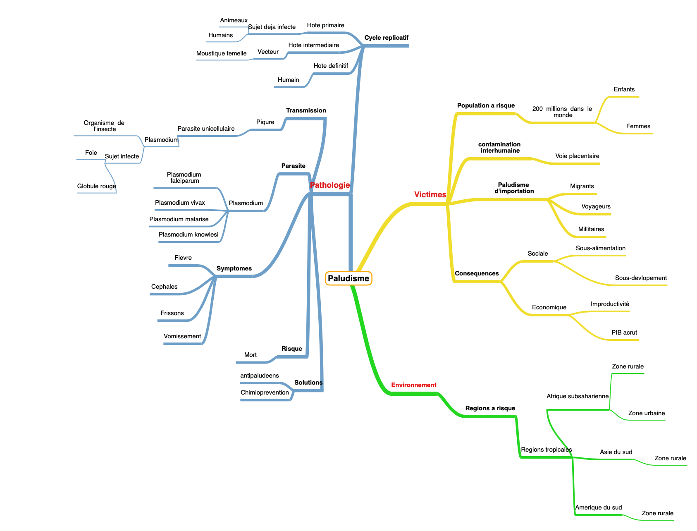

# Le paludisme

Dans l'optique d'étude d'un modèle dynamique, celle des épidémies nous semblais attrayant étant donné le contexte exacerber actuel. Nous évitions donc l'idée de prendre comme sujet d'étude celui du coronavirus étant donné de l'abscence de données. Nous nous sommes donc tournés vers des épidémies encore d'actulalité mais avec des informations précises, alors l'idée de prendre comme thème le paludisme dans le cadre de la transmission du virus nous semblait convenable.  

Le paludisme ou malaria est une pathologie parasitaire du au Plasmodium, transmis à l’Homme par la piqûre d’un moustique femelle, l’Anophèle. Une fois dans le sang, le parasite va dans les cellules du foie pour s’y multiplier créant une infection. Cette dernière est responsable de la mort de plus de 400 000 personnes par an. La plupart des victimes se trouvent sur le continent africain ou dans des zones tropicales défavorisées. Plus de 60% des victimes de la maladie sont des enfants. Des saisons des pluies plus longues et plus intenses sont généralement synonymes d’augmentation des cas de
paludisme, l’Anophèle appréciant pondre ses œufs dans l’eau.

Même si il existe des traitements antipaludéens qui ont permis une baisse spectaculaire des cas de paludisme, malheureusement on commence à documenter des cas de résistance à ces molécules. De plus, tout le monde ne peut pas profiter de ces traitements.

#  Objectif et méthode 

Notre projet de recherche vise à déterminer le facteur responsables de la croissance du paludisme, nous avions pour mission de lister et comparer les méthodes de préventions dans les pays les plus vulnérables plus precisement dans un pays très touché par cette epidemie qui est le Nigeria un pays subsaharien, mais aussi d’analyser les ressources dont bénéficient ces population, et enfin de comprendre quelle sont les populations à risque.
Pour mettre à bien notre étude nous avons confronté plusieurs textes, certains grands publics, d’autres sont scientifiques.

## English version

# The malaria

In order to study a dynamic model, the epidemics ones seems attractive to us because of the current context. Therefore we avoided the idea of taking the coronavirus as a subject of study due the lack of data. We turned to epidemics that are still topical but with precise information, so the idea of taking malaria as a theme in the context of transmission seemed appropriate to us.

The Malaria is a parasitic pathology due to Plasmodium, transmitted to humans by the bite of a female mosquito which is the Anopheles. Once in the blood, the parasite goes to the liver cells to multiply creating an infection. This one is responsible for the deaths of over 400,000 people a year. Most of the victims are on the African continent or in deprived tropical areas. More than 60% of the victims due the disease are children. Seasons with intense rainy shows generally the increase of cases due to Anopheles enjoying laying their eggs in water.

Even if there are anti-malarial treatments that have led to a spectacular drop in malaria cases, unfortunately we are starting to document cases of resistance to these molecules. Furthermore, not everyone can benefit these treatments.

#  Objective and method

Our documentary research project aims to determine the factor responsible for the growth of malaria, our mission was to list and compare prevention methods in the most vulnerable countries more precisely in a country very affected by this epidemic which is Nigeria a Sub-Saharan country, but also to analyze the resources from which these populations benefit, and finally to understand which populations are at risk.
To complete our study, we compared several texts, some general audiences, others are scientific.

## Présentation de l'équipe

|(´・ω・｀)| ( ͡° ͜ʖ ͡°) | ಠ_ಠ | ᕕ( ᐛ )ᕗ |ᕕ( ᐛ )ᕗ |
|-----|--|--|--|--|
| S.MUHAMMAD| J. AOUCHICHE | M. CHIKH  | A. AISSAOUI  | R.TAIBI |

## Description synthétique du projet

**Problématique :** Comment se propage le paludisme ?
Quelles sont les sous-populations les plus à risque au nigeria et quels sont les facteurs qui provoquent la croissance de transmission ?

**Hypothèse principale :** Les méthodes de prévention ne sont pas fournies par l'etat et/ou les populations ne disposent pas des ressources nécessaires pour en bénéficier .
Le moustique est de plus en plus résistant au anciennes méthodes antipaludéennes (pesticides antibiotique anciennes génération)

**Hypothèses secondaires :** La transmission par voie placentaire est la plus répandue, une baisse donc de fécondité au Nigeria pendant un moment ferait diminuer considérablement les cas de paludisme au pays

**Objectifs :** Classer puis déterminer les sous-populations les plus vulnérables au nigeria par taux de contamination et taux de décès au fil du temps.
Puis établir la durée d'éradication par simulation et estimer le nombre de décès, de guérisons  et de contaminations.

**Critère(s) d'évaluation :** -  Faire varier les sous populations, en entrée de la simulation, pour déterminer laquelle est la plus vulnérable.
-Les sous populations choisies: femmes,femmes enceintes,enfants <5ans et >5 ans et hommes

- Prendre en compte les outils de ralentissement de la transmission et voir leur incidence sur l’évolution de cette dernière. 

## Présentation structurée des résultats

Pour modéliser notre exemple de paludisme au Nigeria, nous avons décidé de générer une matrice carré de taille (n+1) * (n+1). La variable n sera est initialisée en début de programme. Afin d’avoir un échantillon convenable, nous avons opté pour une matrice de 100*100 (donc n = 99).
Les populations prise en compte seront les hommes, femmes, femmes enceintes, enfant de plus de 5 ans et enfant de -5 ans. Les individus les plus en danger face au paludisme sont les femmes enceintes et les enfants de -5ans. Les chances de décès la première semaine après avoir été infectés seront mises au début du programme comme constantes. Elles diminueront en fonction des semaines passées.
Chaque individu de la matrice sera un tuple (1-type individus (homme, femme…), 2-état de l’individu (infecté, guéri, vide si il n’a rien), 3- le nombre de semaines où il aura été infecté (si il est infecté bien entendu).
Le programme va tout d’abord initialiser la matrice en complétant les types d’individus de la matrice vide en fonction des pourcentages de chaque individu (constantes).  Il initialise également l’état de l’individu (infecté ou non) en fonction du pourcentage de contamination mis en constante.
Ensuite, en s’inspirant du modèle de schelling, le programme parcourt la matrice en mettant à jour l’état du malade : si l’individu devient infecté, si l’individu déjà infecté meurt ou guéri ou infecte ses voisins  et met à jour les nombres de semaine de l’individu infecté.  
Le programme s’arrête lorsque qu’il ne reste plus aucuns individus infectés.
(VOIR L'EXPLICATION DETAILLEE DES FONCTIONS DANS L'AUTRE PARTIE DU PROGRAMME LA PARTIE DU TRAVAIL HEBDOMADAIRE EFFECTUE)
Critique : Les personnes âgées étant minoritaires, nous les avons omis de programme. Cela reste un défaut car cette population a une mortalité importante et pourrait influencer les résultats.
La fonction voisin reste primaire. Elle ne prend en compte que les voisins situés à une case près. Mais une population est toujours en mouvement, donc l’individu situé à la case [0,0] pourrait très bien contaminer la case [99,99]. Cela n’est pas pris en compte dans notre programme.
Dans la fonction mortalité. On émet l’hypothèse que la chance de mortalité vautre pourcentage de la mortalité/ le nombre de semaines. Ce chiffre est erroné mais il reste bien représentatif de la chute du pourcentage de décès en fonction du temps. 

Nous allons montrer la différence entre 2 simulations qui ont une constantes nb_initial_contamine différente. Ce chiffre qui peut diminuer par l’usage de moustiquaires par exemple. La première simulation aura cette constante à 80%, la suivante à 20% (nous laisserons la constantes pourcent_contamination à 40% afin qu’ (il n’influence pas les courbes) .
 
 SIMULATION 1 (à 80%) :
 

 
 SIMULATION 2 (à 20%) :
 
 
 
 On peut remarquer qu’il y a deux fois moins de mort entre les deux simulations. Cela montre que avant l’infection des moustiques, les moyens mis en œuvres afin d’empêcher leur piqûre diminue significativement l’impact du paludisme.

Nous allons montrer la différence entre 2 simulations qui ont une constantes pourcent_contamination différente. Ce chiffre qui peut diminuer par les précautions mis en place pour éviter aux habitants de transmettre la maladie. Cela diminue donc le taux de contamination.
On laissera la constante nb_initial_contamine à 20% afin qu’il ne fausse pas la courbe.

Simulation 1 (à 80 %) :

Simulation 2 (à 20%) :

On peut voir qu’il y a une différence d’à peu près 1800 morts entre les deux simulations. Ceci est dû au taux d’infection bas, la maladie se propage moins, donc cela crée une différence de morts.

## Lien vers page de blog : <a href="blog.html"> C'est ici ! </a>

## Bibliographie :
[1] Wikipédia, « Démographie du Nigeria », https://fr.wikipedia.org/wiki/D
%C3%A9mographie_du_Nigeria, janvier 2020.

[2] OMS, « World malaria report », OMS, https://www.who.int/malaria/publications/world-malaria-
report-2018/report/fr/, novembre 2018.

[3] Unicef, « Malaria », Unicef, https://data.unicef.org/topic/child-health/malaria/, octobre 2019.

[4] A. K. Adeneye, A. S. Jegede, E. E. Nwokocha, M. A. Mafe, Journal of infection and Public Health,
Volume 7, Issue 6,JNovember–December 2014, Pages 522-533
« Perception and affordability of long-lasting insecticide-treated nets among pregnant women and
mothers of children under five years in Ogun State, Nigeria » ,
https://www.sciencedirect.com/science/article/pii/S1876034114001087?via%3Dihub , Journal of
infection and Public Health, Volume 7, Issue 6, p. 522-533, Novembre Décembre 2014.

[5] BAUME, Carol A; CELESTE MARIN, M, Academy for Educational Development, Washington, DC,
United States, « Intra-household mosquito net use in Ethiopia, Ghana, Mali, Nigeria, Senegal, and
Zambia : Are nets being used? Who in the household uses them? »,
http://www.ajtmh.org/docserver/fulltext/14761645/77/5/0770963.pdf?
expires=1588323792&id=id&accname=guest&checksum=C08771287CD7C324B5F09D81E62D3F83 ,
p. 964-970, 2007.

[6] O. G. Ajakaye et M. R. Ibukunoluwa, « Prevalence and risk of malaria, anemia and malnutrition
among children in IDPs camp in Edo State, Nigeria », https://www-sciencedirect-
com.accesdistant.sorbonne-universite.fr/science/article/pii/S240567311930090X? , février 2020.

**Carte mentale de nos mots-clés,** <a href="https://framindmap.org/mindmaps/index.html#">Framindmap </a> 

